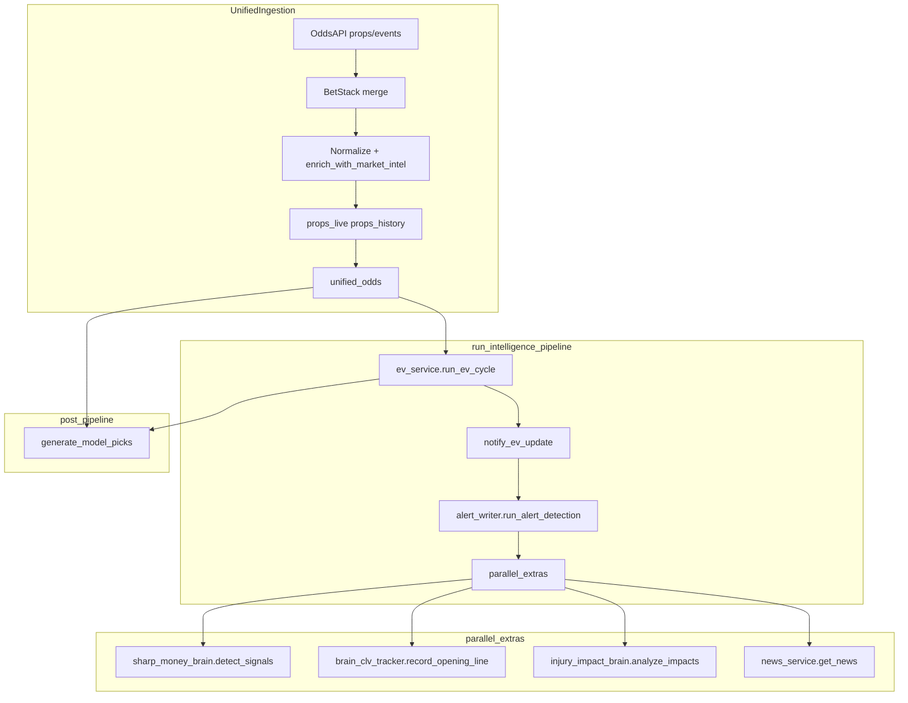
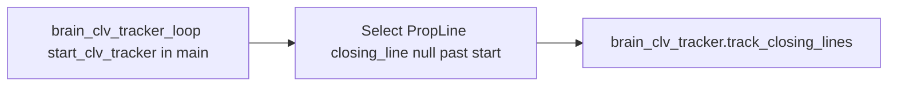

# Brains — full audit, registry, health architecture, and recovery plan

**Status:** authoritative engineering spec (living)  
**Related:** [WATERFALL_PROVIDER_MATRIX.md](./WATERFALL_PROVIDER_MATRIX.md), [UI_DATA_PROVENANCE.md](./UI_DATA_PROVENANCE.md), [PERPLEX_EDGE_MASTER_BLUEPRINT.md](./PERPLEX_EDGE_MASTER_BLUEPRINT.md)

This document treats **every brain as potentially broken** until proven healthy by ingest, persistence, scheduler, API contract, and UI. It inventories **wired**, **partial**, and **orphan** modules, maps dependencies, defines failure signatures, observability, recovery, and **no-silent-failure** UI rules.

---

## 1. Root cause taxonomy (map symptoms to causes)

| Category | Symptom | Typical cause in this repo |
|----------|---------|----------------------------|
| Ingest | `unified_odds` / `props_live` empty | Odds API keys missing; quota exhausted; `unified_ingestion` early return; sport not in `IN_SEASON_PROP_SPORTS` |
| Ingest | Partial rows, no delete | `< MIN_RECORDS_FOR_DELETE` path skips delete — by design; can mask stale board |
| Scheduler | No new signals | Celery worker not running; `ingest_scheduler` not started; APScheduler jobs disabled |
| Async | Pipeline half-runs | `asyncio.gather` misuse or swallowed exceptions (`return_exceptions=True` without per-task logging) — **fixed in code**: see `unified_ingestion.run_intelligence_pipeline` |
| Join / key | EV empty but props full | `ev_service` filters `unified_odds.sport` with keyword match vs `sport_key` mismatch (`basketball_nba` vs `nba`) |
| Join / key | Brain UI empty | `ModelPick.status == 'active'` in UI query while picks remain `pending` — **mitigated**: query accepts `active` and `pending` |
| Router | Top Edges always empty | Frontend called `/api/ev/top` while backend exposed `/api/ev/ev-top` — **fixed**: alias route `/top` |
| Cache | CLV never closes | Redis unavailable; `clv:open:*` keys not set; `PropLine` rows missing |
| WS | UI never updates | `notify_ev_update` fails silently; no clients; mount path `/api/ws_ev` |
| LLM | Generic copy | `brain_service` fallback string when keys missing or circuit open |
| Metrics | Random dashboard | `brain_metrics_service` uses `random` for business metrics — **non-production** |
| Dead code | Feature “missing” | `brain_arbitrage_scout`, `brain_bottom_up_projections`, `brain_exposure_risk`, `proof_engine` have **no importers** — roadmap or delete |
| Legacy | Double scout | `jobs/ingestion_service.write_props_to_db` calls `brain_odds_scout` but **is not referenced** by `ingest_active_odds` (unified path only) — documented as **orphan entrypoint** |

---

## 2. Execution graph (primary spine)

After multi-provider ingest and `upsert_unified_odds`, intelligence runs in one orchestrator:

**CLV close loop** (parallel lifecycle, not inside `run_intelligence_pipeline`):

**Files:** [apps/api/src/services/unified_ingestion.py](apps/api/src/services/unified_ingestion.py), [apps/api/src/services/ev_service.py](apps/api/src/services/ev_service.py), [apps/api/src/services/alert_writer.py](apps/api/src/services/alert_writer.py), [apps/api/src/services/brains.py](apps/api/src/services/brains.py), [apps/api/src/services/brain_clv_tracker_loop.py](apps/api/src/services/brain_clv_tracker_loop.py), [apps/api/src/main.py](apps/api/src/main.py).

---

## 3. Brain registry

| registry_id | implementation | status | notes |
|-------------|------------------|--------|-------|
| ingest_pipeline | `UnifiedIngestionService` | core | Stages 1–6 in `unified_ingestion.py` |
| market_intel_enrichment | `enrich_with_market_intel` | core | Heuristic confidence from book count |
| ev_engine | `EVService.run_ev_cycle` | core | Writes `ev_signals` via SQL insert from `UnifiedEVSignal` mapping |
| alert_whale_steam | `alert_writer.run_alert_detection` | core | Whales + steam SQL → `whale_moves`, `steam_events`, `sharp_alerts` |
| sharp_money_layer1 | `SharpMoneyBrain.detect_signals` | core | Redis compare + `sharp_signals` |
| clv_opening_cache | `BrainCLVTracker.record_opening_line` | core | Redis `clv:open:*` |
| clv_close_loop | `clv_tracking_loop` + `track_closing_lines` | core | `PropLine` driven |
| injury_impact | `InjuryImpactBrain` | partial | ESPN injuries; NFL branch needs `position` on injury dict (**fixed**) |
| model_pick_promoter | `generate_model_picks` | core | Reads `UnifiedEVSignal` / `ev_signals`, writes `model_picks`, `brain_log` |
| neural_prop_scorer_ui | `get_prop_score` | core | Reads `model_picks` — status filter widened |
| parlay_mc_brain | `build_parlay` + `monte_carlo_service` | core | Top `ModelPick` by EV |
| parlay_bundle_router | `parlays_router` + `parlay_service` | core | Reads high-edge `UnifiedEVSignal` |
| hit_rate_engine | `HitRateService` | core | Aggregates graded `ModelPick` |
| grading_engine | `grading_service` | core | APScheduler + props router trigger |
| steam_api_surface | `routers/steam.py` | read | `steam_events` |
| whale_api_surface | `routers/whale.py` | read | `whale_moves` / related |
| sharp_api_surface | `routers/sharp.py` | read | Sharp signals / alerts |
| oracle_llm | `oracle_service` | separate | Tiered LLM routes |
| market_intel_llm | `intel_service` | llm | Games context + LLM JSON |
| brain_llm_reasoning | `brain_service` | llm | `generate_decision` for logs |
| hero_player_view | `routers/hero.py` | aggregate | `PropLive`, `PropHistory`, `HitRateModel` |
| brain_metrics_system | `brain_metrics_service` | **non_prod** | Random business metrics — replace or gate |
| brain_odds_scout | `brain_odds_scout` | **orphan_path** | Only reachable via deprecated `write_props_to_db` (unused) |
| kalshi_intel | kalshi routers + `KalshiArbAlert` | tiered | Exchange semantics |
| ws_ev_broadcast | `ws_ev` | optional | After EV cycle |
| scheduler_probe | Celery `ev_engine` + `ingest_scheduler` + grading in `main` | ops | |

---

## 4. Per-brain specification (template 1–15)

Below, **each brain** uses the same fifteen fields:

1. Purpose  
2. Inputs required  
3. Upstream APIs / tables  
4. Waterfall stage (after which it runs)  
5. Preprocessing  
6. Outputs  
7. Consumer pages / routes  
8. How often it runs  
9. Batch / stream / scheduled / on-demand  
10. Stale / partial / empty / conflicting behavior  
11. Fallback  
12. Health metrics / logs  
13. Admin / replay  
14. UI if unavailable  
15. E2E verification  

### 4.1 `ingest_pipeline` (UnifiedIngestionService)

1. **Purpose:** Fetch multi-book odds/props, merge BetStack, normalize, persist.  
2. **Inputs:** `sport_key`; Odds API client; BetStack; optional waterfall games fallback.  
3. **Upstream:** The Odds API, BetStack, `real_data_connector` / waterfall; tables: `props_live`, `props_history`, `unified_odds`, heartbeats `ingest_{sport}`.  
4. **Stage:** Runs **after** external HTTP waterfall (see WATERFALL matrix); first stage of “brain stack.”  
5. **Preprocessing:** `odds_mapper.map_theodds_props_to_records`; player_name null fill.  
6. **Outputs:** Prop rows, unified odds rows, metrics dict, `system_sync_state` touch.  
7. **Consumers:** All downstream brains; `/api/props/*`, `/api/meta/inspect`.  
8. **Frequency:** Celery + scheduler (e.g. 30m active sports) + manual `meta/ingest-nba`.  
9. **Scheduled + on-demand.**  
10. **Empty:** Skips destructive delete when `< MIN_RECORDS_FOR_DELETE`; logs warning.  
11. **Fallback:** Waterfall games for odds_raw shape (not full books).  
12. **Health:** `HeartbeatService` `ingest_{sport}`; logs per stage.  
13. **Admin:** Re-run `unified_ingestion.run(sport)`; `meta/ingest-nba` style endpoints.  
14. **UI:** Stale banner from `last_odds_sync` / heartbeats.  
15. **E2E:** After run, `unified_odds` row count > 0 for sport; props_live non-null lines.

### 4.2 `market_intel_enrichment`

1. **Purpose:** Tag best book, sharp/soft flags, crude `confidence` from book count.  
2. **Inputs:** `List[PropRecord]` post-map.  
3. **Tables:** in-memory only until persist. Config: `SHARP_BOOKMAKERS`, `SOFT_BOOKMAKERS` in settings.  
4. **Stage:** Immediately before DB upsert inside ingest.  
5. **Preprocessing:** Group by `(game_id, market_key, player_name, line)`.  
6. **Outputs:** Mutated `PropRecord` fields `is_best_over`, `confidence`, etc.  
7. **Consumers:** EV + display props; downstream heuristics.  
8. **Same as ingest.**  
9. **Synchronous in-process.**  
10. **Single-book groups:** low confidence — should suppress overconfidence in UI (future).  
11. **No external fallback.**  
12. **Logs:** implicit via ingest metrics.  
13. **Replay:** Re-run ingest.  
14. **UI:** If confidence null — show “insufficient book depth.”  
15. **E2E:** Multi-book fixture produces `is_best_*` true on one row.

### 4.3 `ev_engine` (EVService)

1. **Purpose:** Sharp-weighted fair probability; edge vs books; persist signals.  
2. **Inputs:** All `unified_odds` rows (SQL `SELECT *`), filtered in Python by sport keyword.  
3. **Tables:** `unified_odds` → `ev_signals` (insert via raw SQL in `upsert_ev_signals`). Model class `UnifiedEVSignal` maps ORM to same logical data.  
4. **Stage:** After `unified_odds` written.  
5. **Preprocessing:** Group by `(event_id, market_key, line, player_name)` × outcome × book.  
6. **Outputs:** EV rows; heartbeat `ev_grader_{sport}` idle_no_data.  
7. **Consumers:** `/api/ev`, `/api/ev/top`, `/api/parlays`, `generate_model_picks`, Top Edges page.  
8. **Each ingest cycle per sport.**  
9. **On-demand inside ingest;** can be triggered separately via `ev_service.run_ev_cycle`.  
10. **Empty unified_odds:** early return; heartbeat idle.  
11. **Fallback:** `/api/ev` has secondary query from `props_live` (on-the-fly EV) when `ev_signals` empty.  
12. **Logs:** row visibility log line; heartbeat.  
13. **Admin:** `POST /api/ev/compute` (if exposed); replay ingest + EV.  
14. **UI:** Show `unified_odds` count and last ingest time when zero signals.  
15. **E2E:** Known fixture → nonzero `ev_signals` with expected `edge_percent`.

### 4.4 `alert_whale_steam` (alert_writer)

1. **Purpose:** Detect whale outliers and steam velocity from `unified_odds` / `props_history`.  
2. **Inputs:** `sport`; async DB session.  
3. **Tables:** `unified_odds`, `props_history`; writes `whale_moves`, `steam_events`, `sharp_alerts`.  
4. **Stage:** After EV in pipeline (same transaction window as session).  
5. **Preprocessing:** SQL CTEs; sharp book list constant.  
6. **Outputs:** Inserted alert rows.  
7. **Consumers:** `/api/signals`, steam/whale/sharp UIs.  
8. **Each ingest.**  
9. **Batch.**  
10. **No history window overlap:** empty steam — not an error.  
11. **No fallback beyond sharp_alerts legacy inserts.**  
12. **Logs:** `[INTELLIGENCE ENGINE]` count lines.  
13. **Replay:** Re-run `run_alert_detection(sport)` with DB snapshot.  
14. **UI:** “No steam in last 24h” vs “steam pipeline offline” if DB error.  
15. **E2E:** Synthetic props_history timestamps triggering steam row.

### 4.5 `sharp_money_layer1` (SharpMoneyBrain)

1. **Purpose:** Line/price delta vs Redis snapshot → `sharp_signals`.  
2. **Inputs:** `UnifiedOdds` ORM rows for sport.  
3. **Redis** keys `sharp:track:...`; table `sharp_signals`.  
4. **Stage:** Parallel extras after `run_alert_detection`.  
5. **Preprocessing:** JSON serialize state in Redis.  
6. **Outputs:** `sharp_signals` rows.  
7. **Consumers:** `/api/brain/steam-alerts` reads `SharpSignal` (type steam); brain advanced.  
8. **Each ingest.**  
9. **Concurrent task in gather.**  
10. **No Redis:** failures should log — verify in ops.  
11. **No DB fallback for tracking state.**  
12. **Logs:** detection info.  
13. **Replay:** Clear Redis keys + re-ingest.  
15. **E2E:** Price change between runs creates signal.

### 4.6 `clv_opening_cache` + `clv_close_loop`

**Opening (BrainCLVTracker.record_opening_line)**  
1. **Purpose:** Store first-seen line/price in Redis for CLV baseline.  
3. **Cache Redis** + eventual `CLVRecord` / trades via tracker helpers.  
4. **Stage:** After props list exists (uses `PropRecord` / unified row shapes).  
10. **Missing line/price:** skip with warning log.

**Close loop**  
1. **Purpose:** For started games, snapshot closing lines on `PropLine`.  
2. **Inputs:** `PropLine` rows with `closing_line IS NULL` and `start_time <= now`.  
3. **Tables:** `PropLine`, persistence helpers.  
8. **Every 5 minutes** (`asyncio.sleep(300)`).  
14. **UI:** CLV page shows “closing capture pending” if no close.

### 4.7 `injury_impact` (InjuryImpactBrain)

1. **Purpose:** Persist high/medium injury impacts for brain UI.  
2. **Inputs:** `injury_service.get_injuries` (ESPN-backed).  
3. **Tables:** `injuries` / `InjuryImpact`, `InjuryImpactEvent`.  
4. **Stage:** Parallel extras.  
10. **NFL KeyError risk:** mitigated by adding `position` onto flattened injury dict from ESPN athlete.  
15. **E2E:** Mock injury list with high impact → rows in `InjuryImpact`.

### 4.8 `model_pick_promoter` + `neural_prop_scorer_ui`

1. **Purpose:** Promote EV signals to `model_picks` + `brain_log`; UI reads picks.  
3. **Tables:** `ev_signals` / `UnifiedEVSignal`, `model_picks`, `brain_log`.  
6. **Outputs:** Active/pending picks, reasoning text from LLM or fallback.  
7. **Pages:** `/brain`, brain router `/decisions`, dashboard metrics.  
10. **No signals:** returns 0 picks — UI must say “no EV signals ingested.”  
11. **LLM failure:** static reasoning string from `brain_service`.  
12. **Heartbeat:** `model_inference`.  
14. **UI:** Distinguish tier-gated empty vs true zero.  
15. **E2E:** `generate_model_picks` after seeded `ev_signals`.

**Query note:** `get_prop_score` includes `status in ('active','pending')` to avoid silent empty brain.

### 4.9 `parlay_mc_brain` + `parlay_bundle_router`

1. **Purpose:** Monte Carlo multi-leg from picks vs bundle suggestions from EV.  
3. **Tables:** `model_picks` vs `UnifiedEVSignal`.  
7. **`/api/brain/parlay-builder`**, `/api/parlays`.  
9. **On-demand HTTP.**  
10. **<2 picks:** returns empty legs — UI copy required.  
15. **E2E:** `/api/parlays` returns `UniversalResponse` with bundles when EV rows exist.

### 4.10 `hit_rate_engine` + `grading_engine`

1. **Purpose:** Summaries over graded picks; grade props.  
3. **Table:** `model_picks` (`won` not null).  
7. **`/api/hit-rate/*`, performance pages.**  
8. **Grading on schedule + manual router.**  
10. **No graded picks:** `awaiting_ingest` status in summary.  
15. **E2E:** Grade cycle flips `won` boolean.

### 4.11 `steam_api_surface` / `whale_api_surface` / `sharp_api_surface`

1. **Purpose:** Read-only HTTP for alerts tables.  
3. **`steam_events`, `whale_moves`, sharp tables.**  
7. **`/steam`, `/whale`, `/sharp` web routes.**  
9. **On-demand.**  
10. **Empty:** legitimate “no alerts” — include `last_ingest_at` in meta (future).  
14. **UI:** Show pipeline dependency diagram tooltip (future).

### 4.12 LLM brains (`oracle_llm`, `market_intel_llm`, `brain_llm_reasoning`)

1. **Purpose:** Natural language reasoning / intel cards.  
2. **API keys:** Groq, OpenRouter, OpenAI fallbacks per `brain_service`.  
9. **On-demand.**  
10. **Key missing:** template fallback strings — **must** badge as “model narrative, not odds.”  
12. **Logs:** provider failures.  
15. **E2E:** Mock LLM or contract test for JSON shape.

### 4.13 `hero_player_view`

1. **Purpose:** Single-player consolidated view.  
3. **`PropLive`, `PropHistory`, `HitRateModel`.**  
10. **No PropLive:** `current` nulls — return explicit `status: success` with null fields and message.  
15. **E2E:** Query known player after ingest.

### 4.14 `brain_metrics_system` (NON-PRODUCTION)

1. **Purpose:** Intended ops metrics — **currently simulated random business metrics.**  
13. **Admin:** Disable in prod or replace with SQL aggregates (`brain_business_metrics` if used).  
14. **UI:** Hide or label “demo metrics.”

### 4.15 `brain_odds_scout` (legacy)

1. **Purpose:** Historical prop analysis path.  
3. **Only** `jobs.ingestion_service.write_props_to_db` — **no live caller** in repo grep.  
13. **Decision:** delete path or wire behind `ENABLE_BRAIN_ODDS_SCOUT_LEGACY` if reintroduced.

### 4.16 `kalshi_intel` + `ws_ev_broadcast` + `scheduler_probe`

Documented in Kalshi routers and `workers/ev_engine` + `ingest_scheduler`. **E2E:** Celery task dispatch logs; WS client receives message after `notify_ev_update`.

---

## 5. Sport-specific behavior (profiles, not separate codebases)

| sport_key | Prop markets (ingest) | Notes |
|-----------|------------------------|--------|
| basketball_nba | player_points,rebounds,assists | In `PROP_MARKETS_BY_SPORT` + in-season list |
| baseball_mlb | pitcher_strikeouts,batter_hits | Capped events per cycle |
| icehockey_nhl | player_points,player_shots_on_goal | |
| americanfootball_nfl | pass_yds,rush_yds | **Out of IN_SEASON list** — props fetch skipped by config |

**Rebuild approach:** move profiles to YAML (`apps/api/src/core/sport_brain_profiles.yaml` future) feeding ingest caps, EV thresholds, and UI copy.

---

## 6. Brain Health Architecture

### 6.1 Registry schema (target)

Store in DB table `brain_registry` (future) or YAML:

- `id`, `version`, `upstream_feeds[]`, `input_tables[]`, `output_tables[]`, `schedule`, `owner`, `downstream_routes[]`.

### 6.2 Per-run metrics (target)

Table `brain_execution_runs` (future):

- `brain_id`, `started_at`, `finished_at`, `status`, `rows_read`, `rows_written`, `error_class`, `sport`, `engine_version`, `input_snapshot_hash`.

### 6.3 State labels

| label | meaning |
|-------|---------|
| healthy | last success < SLA; nonzero expected outputs when inputs exist |
| degraded | partial inputs or fallback odds |
| stale_input | upstream heartbeat older than threshold |
| offline | worker down or repeated exceptions |
| suppressed | kill-switch or manual pause |

### 6.4 Admin rerun

- **Dry-run:** validate inputs, estimate rows, no writes.  
- **Write:** acquire per-brain distributed lock; record `brain_execution_runs`.  
- **Kill-switch:** env `BRAIN_DISABLE_{ID}=1` skips stage in `run_intelligence_pipeline` (future hook).

### 6.5 DLQ

- Failed runs store stack trace + sport + last unified_odds count in `brain_execution_runs` or extend `Heartbeat.meta`.

### 6.6 Audit trail for UI outputs

- Attach `engine_version` (already on EV signals) and future `brain_run_id` foreign key on `model_picks` / `whale_moves`.

---

## 7. Admin “Brains Ops” (spec)

**Route:** `/admin/brains` (web) + `GET /api/admin/brains/status` (future API).

**Panels:**

1. Matrix Brain × Sport × Env (row counts, last heartbeat).  
2. Queue depth (Celery Redis broker metrics — external).  
3. Failure reasons (taxonomy §1).  
4. Rerun / backfill form (sport, time window, brains[]).  
5. Model version (`engine_version` distribution).  
6. Zero-output detector (signals was nonzero, now zero).  
7. Null-field detector (`confidence IS NULL`).  
8. Downstream page map (reverse index from registry).

---

## 8. UI — no silent failure (required behavior)

| condition | UI must show |
|-----------|--------------|
| Tier blocked | “Pro/Elite required” — not empty JSON |
| Upstream table empty | Table name + “run ingest” CTA + link to health |
| Fallback odds | Badge per UI_DATA_PROVENANCE |
| API 404 | “Client misconfiguration” (e.g. fixed `/api/ev/top`) |
| WS disconnected | “Live updates unavailable; data may be stale” |

---

## 9. Brains Recovery Plan (runbook)

1. **Recover waterfall inputs:** verify Odds API / BetStack keys; run `unified_ingestion.run(sport)` manually.  
2. **Validate canonical mappings:** `unified_odds.sport` must match `ev_service` keyword filter for that `sport_key`.  
3. **Restore schedulers:** Celery worker, `ingest_scheduler`, verify `start_clv_tracker` task running.  
4. **Verify persistence:** SQL counts per sport for `unified_odds`, `ev_signals`, `model_picks`.  
5. **Reconnect UI contracts:** align paths (`/api/ev/top`); response `meta` with timestamps.  
6. **Health guards + stale UX:** board health bar from heartbeats + `system_sync_state`.  
7. **E2E tests:** pytest per brain critical path (ingest → EV → pick).  
8. **Backfill:** replay ingest for missed windows; re-run `generate_model_picks`.  
9. **Kill-switches:** disable single brain in pipeline during incident.  
10. **Production-ready gate:** SLA met for 7d; error rate < threshold; DLQ wired; UI suppression tested; playbook signed.

---

## 10. Launch criteria (per brain)

- [ ] Inputs documented and monitored.  
- [ ] Outputs persisted with version / audit when user-facing.  
- [ ] Failure modes logged, not swallowed.  
- [ ] UI shows unavailable reason.  
- [ ] Automated test or smoke script exists (`verify_brain_stack.py` extended).  
- [ ] Rollback / kill-switch documented.

---

## 11. Code changes applied with this spec (traceability)

| item | change |
|------|--------|
| EV Top route | [apps/api/src/routers/ev.py](apps/api/src/routers/ev.py) adds `GET /top` (alias of top edges). |
| Intelligence gather | [apps/api/src/services/unified_ingestion.py](apps/api/src/services/unified_ingestion.py) awaits parallel extras with per-task exception logging. |
| ModelPick visibility | [apps/api/src/services/brain_advanced_service.py](apps/api/src/services/brain_advanced_service.py) `get_prop_score` includes `pending` picks. |
| Injury NFL | [apps/api/src/services/brain_injury_impact.py](apps/api/src/services/brain_injury_impact.py) adds safe `position` field. |
| Legacy scout | [apps/api/src/jobs/ingestion_service.py](apps/api/src/jobs/ingestion_service.py) documents deprecation on unused `write_props_to_db`. |

---

## Appendix A. Compact fifteen-field matrix (secondary / surface brains)

Columns: **Purpose | Primary tables | Stage | Cadence | Mode | Empty behavior | Health | UI unavailable | E2E hook**

| registry_id | Purpose | Primary tables | Stage | Cadence | Mode | Empty behavior | Health | UI unavailable | E2E |
|-------------|---------|----------------|-------|---------|------|------------------|--------|----------------|-----|
| news_pipeline | Fetch headlines | external news cache / DB | post-unified | per ingest | async task | silent skip OK | log only | “News feed paused” | mock HTTP |
| steam_api_surface | Read steam_events | steam_events | post-alert | on HTTP GET | on-demand | empty list OK | add meta timestamp | “No steam 24h” | seed history rows |
| whale_api_surface | Read whale_moves | whale_moves | post-alert | on-demand | on-demand | empty OK | heartbeat link | “No whale outliers” | SQL fixture |
| sharp_api_surface | Sharp feed | sharp_alerts / sharp_signals | post-alert | on-demand | on-demand | empty OK | same | tier + empty | integration |
| oracle_llm | Deep Q&A | none persistent | user | on-demand | on-demand | fallback text | token errors | “Oracle offline” | contract JSON |
| market_intel_llm | Slate intel cards | none | user | on-demand | on-demand | `_get_fallback_intel` | LLM logs | badge “synthetic” | JSON parse |
| ws_ev_broadcast | Push EV refresh | n/a | post-EV | per cycle | websocket | no clients | log error | “Live EV off” | ws client test |
| scheduler_probe | Celery ingest | n/a | infra | beat | scheduled | missed beat = offline | Celery metrics | ops banner | worker health |
| grading_engine | Grade props | props_live / picks | post-game | cron + API | batch | no rows | grader logs | “Nothing to grade” | unit |
| hit_rate_engine | ROI / streaks | model_picks | post-grade | on HTTP | on-demand | zeros | summary.status | explain low n | SQL seed |
| hero_player_view | Player desk | prop_live/history | post-ingest | on HTTP | on-demand | null current | error field | “No live line” | API query |
| kalshi_intel | Contracts | kalshi_* tables | independent | poll/ws | mixed | auth fail | kalshi heartbeat | tier gate | mock kalshi |

---

*End of spec. Update registry rows when wiring new brains (OddsPapi, Sportradar, etc.).*
