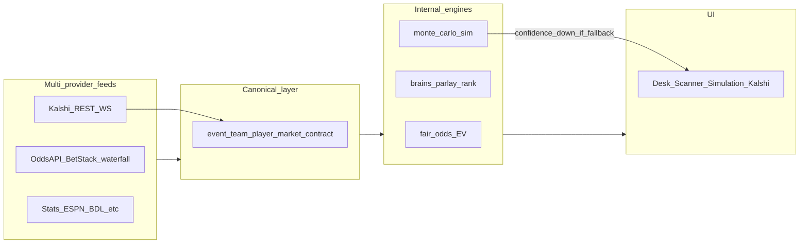

# Perplex Edge / LUCRIX — Master Product Blueprint V2

**Version:** 2.1 (event-market + simulation + full waterfall narrative)  
**Stack:** Next.js 14 (`apps/web`) · FastAPI (`apps/api`) · Postgres (Supabase) · Redis (optional)  
**Supersedes for full V2 scope:** this document extends and supersedes narrative scope in [PERPLEX_EDGE_MASTER_BLUEPRINT.md](./PERPLEX_EDGE_MASTER_BLUEPRINT.md) (that file remains as a snapshot; use **this** doc for V2 planning).

**Companion specs**

- [PERPLEX_EDGE_V2_RUNTIME_CONTRACT.md](./PERPLEX_EDGE_V2_RUNTIME_CONTRACT.md) — **operational truth:** failure-class matrix, `/health` vs `/health/deps`, API `meta.degradation` + freshness envelope, DLQ / mapping defenses, WS reconnect rules, MVP engineering slice (binds “200 OK” to honest UI).
- [WATERFALL_PROVIDER_MATRIX.md](./WATERFALL_PROVIDER_MATRIX.md) — Part I (inventory + legacy matrix); **Part II — V2 routing** (domain matrix with Primary / Secondary / Tertiary / Cached / Degraded, provider routing contract, audit schema).
- [UI_DATA_PROVENANCE.md](./UI_DATA_PROVENANCE.md) — badges, stale copy, confidence.
- [BRAINS_AUDIT_AND_REBUILD_SPEC.md](./BRAINS_AUDIT_AND_REBUILD_SPEC.md) — treat every brain as **broken until proven**; registry, health architecture, recovery, UI no-silent-failure rules.
- [PRODUCT_BLUEPRINT.md](./PRODUCT_BLUEPRINT.md) — route table and implementation summary.

**External references (vendors, compliance context)**

- [The Odds API](https://the-odds-api.com) — multi-book odds/props vendor landscape.
- [Sports APIs overview (The Odds API)](https://the-odds-api.com/sports-odds-data/sports-apis.html) — why multi-feed architecture matters.
- [Kalshi — API keys / getting started](https://docs.kalshi.com/getting_started/api_keys) — exchange authentication and operational constraints.

---

## 0. Executive framing (V2)

### 0.1 What this product is

**LUCRIX (Perplex Edge)** is a **private market intelligence operating system** for:

1. **Sportsbook-adjacent bettors** who need multi-book odds, props, alt lines, CLV discipline, and flow analytics.
2. **Event-market traders** who operate on **regulated prediction-market exchanges** (e.g. Kalshi CFTC-style event contracts) and require **separate** semantics from American sportsbook odds.

It is a **fusion layer**: sportsbook feeds, stats and schedule feeds, exchange contracts (sports-linked and **life-event**), optional **life-event** narrative markets where product policy allows, internal projections, **Monte Carlo scenario engines**, and graded user portfolios—normalized into **canonical** event, team, player, market, and **contract** objects—then scored for **EV**, **edge quality**, **CLV**, **hit-rate integrity**, **disagreement**, **steam / whale / sharp proxies**, **liquidity**, **correlation-adjusted parlay pricing**, **simulation fan outputs**, and **confidence-adjusted** actionability.

**Experience target:** Bloomberg-style density + quant research workstation + sharp bettor execution workflow + **event-market terminal** (order book, resolution clock, venue-separated risk).

### 0.2 What this product is not

- Not a single-vendor odds app. **The Odds API** is one tier in a **multi-provider waterfall**; strategic value is **fusion and failover**, not one REST vendor.
- Not a promise of profit. All edges and simulations are **estimates** with explicit uncertainty and data lineage.
- Not “Kalshi implied prob = sportsbook fair odds.” **Binary contracts** and **regional sportsbook lines** live in different probability spaces; the UI must never merge them without a labeled bridge model.
- Not silent when brains or feeds fail. See **BRAINS_AUDIT_AND_REBUILD_SPEC** and **UI_DATA_PROVENANCE**: show dependency, fallback, stale state, and whether the user can still act safely.

### 0.3 Product pillars (V2)

| Pillar | Description |
|--------|-------------|
| **Multi-source sportsbook intelligence** | Waterfall-fed odds, props, derivatives; internal fair / EV / steam. |
| **Kalshi event markets** | Sports-tagged contracts + liquidity + resolution; tier-gated REST/WS. |
| **Life-event markets** | Isolated desk: separate nav, compliance copy, classifier output; no silent mixing with NBA props. |
| **Monte Carlo / simulation** | First-class **Simulation desk**: joint leg distributions, correlation, scenario fan charts, stress books; inputs gated on ingest quality. |
| **CLV + hit-rate discipline** | Process metrics, not hype; closing capture and grading transparency. |
| **Brains layer** | Audited, observable, rerunnable; see brains spec. |

### 0.4 Intelligence stack (logical diagram)

Brains execution detail: [BRAINS_AUDIT_AND_REBUILD_SPEC.md](./BRAINS_AUDIT_AND_REBUILD_SPEC.md) §2 (spine) and registry table.

---

## 1. Non-negotiable: multi-provider waterfall

All **product narrative**, **sales**, **UI badges**, and **engineering contracts** must assume **multi-source fusion** and **ordered failover** per `apps/api/src/core/waterfall_config.py`, `WaterfallRouter`, `unified_ingestion`, and [WATERFALL_PROVIDER_MATRIX.md](./WATERFALL_PROVIDER_MATRIX.md#part-ii-v2-routing-spec).

**Product vs repo tiering:** Some providers are **contractual or strategic primaries** in V2 product language (e.g. **SportsDataIO** for enterprise depth) while the **repo v1 implementation** may still list them as roadmap until a client module ships. The matrix Part II uses **product_role** vs **repo_status** to avoid lying to engineers or buyers.

---

## 2. Information architecture (V2 nav)

**Primary rail (Desk):** Command · Scanner · Props · EV+ · **Simulation** · CLV · Hit rate · Signals  

**Event markets:** **Kalshi (sports-linked)** · **Kalshi / life-event** (separate entry or sub-tabs with compliance banner)  

**Secondary:** Live · Line move · Tracker · Brain · Parlay lab · Flow (Sharp / Steam / Whale) · Arb · Oracle  

**Portfolio / exposure:** Bet tracker · Ledger · Bankroll · (future) **Cross-venue exposure**  

**Utility:** Slate · Schedule · Injuries · News · Books · Markets · History · Performance · Streaks  

**Institutional:** Scanner · Execution · Strategy lab · Affiliate · Settings  

**System:** Settings · Pricing · Subscription · Checkout · Upgrade · Support · **Admin / Brains Ops** · Audit  

**Routes (existing in repo, non-exhaustive):** under `apps/web/src/app/(app)/` — e.g. `/dashboard`, `/player-props`, `/ev`, `/parlay-builder`, `/kalshi`, `/steam`, `/clv`, `/brain`, `/admin`, etc. **Future:** `/simulation` or `/scenarios` (Monte Carlo desk) when shipped; document as **planned** until route exists.

---

## 3. Page and widget contracts (V2 summary)

Legend: **Domains** = keys into [WATERFALL_PROVIDER_MATRIX Part II](./WATERFALL_PROVIDER_MATRIX.md#part-ii-v2-routing-spec). **Brains** = registry IDs in [BRAINS_AUDIT_AND_REBUILD_SPEC.md](./BRAINS_AUDIT_AND_REBUILD_SPEC.md). **Degraded** = user-visible state when upstream fails.

| Area | Route(s) (typical) | User job | Primary domains | Brains touched | Degraded UI |
|------|-------------------|----------|-----------------|----------------|-------------|
| Desk | `/dashboard` | Day-open health, top edges | pregame_odds, props, steam_inputs | ev_engine, ingest_pipeline | Stale banner; dependency name |
| Scanner | `/institutional/scanner` | Cross-market scan | pregame_odds, props, book_availability | alert_whale_steam (context) | Empty + filter reset + ingest CTA |
| Props | `/player-props`, `/props` | Board | player_props, mainlines_derivatives | ingest, market_intel | Single-book warning; fallback badge |
| EV+ | `/ev`, `/top-edges` | Edge table | pregame_odds, CLV_inputs | ev_engine, model_pick_promoter | Zero signals + why |
| **Simulation** | future `/simulation` | Scenarios, joint legs | **monte_carlo_inputs**, parlay_pricing | parlay_mc_brain, monte_carlo_service | “Insufficient book depth / correlation unknown” |
| Parlay | `/parlays`, `/parlay-builder` | Build + price | parlay_pricing, props | parlay_bundle_router, parlay_mc_brain | Leg stripped; SGP disclaimer |
| Flow | `/steam`, `/whale`, `/sharp` | Flow analytics | steam_inputs, whale_sharp_inputs | alert_whale_steam, sharp_money | Low tick density |
| CLV | `/clv` | Process quality | CLV_grading, closing_lines | clv_open/close, grading | No close explanation |
| Hit rate | `/hit-rate` | Graded truth | hit_rate_features | hit_rate_engine, grading_engine | Low n shrink |
| **Kalshi sports** | `/kalshi` (sports tab) | Contracts linked to sports | kalshi_sports_contracts | kalshi_intel | Tier gate; not odds |
| **Kalshi life-event** | `/kalshi` (isolated) or future route | Non-sports events | kalshi_life_event_contracts | kalshi classifier (future) | Compliance + “no sportsbook bridge” |
| Brain | `/brain` | Analyzer queue | ev_signals, model_picks | neural_prop_scorer, model_pick_promoter | Brains spec empty states |
| Admin | `/admin` | Ops | all | registry + heartbeats | Link to Brains Ops spec |

---

## 4. Monte Carlo / simulation system (first-class)

**Purpose:** Answer “what happens to this slip under joint uncertainty?” not only “what is single-point EV?”

**Inputs (must be declared per run)**

- Leg marginal distributions (from projections or implied-from-odds with **confidence penalty** if fallback odds).
- **Correlation matrix** (same-game; partial league-wide priors); unknown correlation must widen intervals and **suppress** overconfident tail claims.
- Book constraints (max stake, alt line availability) — optional v2.
- **Waterfall freshness** — if `meta.fallback_used` or stale ingest, MC output is labeled **degraded** and variance inflated.

**Outputs**

- Joint hit probability, fan chart of PnL at horizon, scenario labels (e.g. injury shock), **leg survival** table.
- **Audit:** `engine_version`, `correlation_model_id`, `random_seed` (future persistence).

**UI**

- Never show MC output without **input health** strip (books count, last ingest, correlation assumption).

**Code touchpoints today:** `monte_carlo_service`, `brain_advanced_service.build_parlay`, `parlays_router`; formal desk is **spec-first** until `/simulation` ships.

---

## 5. Kalshi: sports-linked vs life-event (mandatory split)

| Dimension | Sports-linked contracts | Life-event contracts |
|-----------|-------------------------|----------------------|
| **User** | Bettor + event-market trader bridging book vs exchange | Primarily event-market trader / researcher |
| **Mapping** | Optional `canonical_event_id` when league rules allow | **No** implied sportsbook fair; separate **contract_id** graph |
| **Settlement** | Exchange rulebook + sports results | Exchange rulebook + **independent resolution source** (policy-defined) |
| **UI** | Tab: “Sports” — can show cross-signal to books with **dual badges** | Tab: “Markets” — **no** sportsbook EV column unless explicit bridge model toggled |
| **Risk copy** | CFTC / exchange disclosures | Stronger disclosure; no parlay correlation with NBA SGP |

---

## 6. Provider universe (V2 narrative list)

Aligned with [WATERFALL_PROVIDER_MATRIX.md](./WATERFALL_PROVIDER_MATRIX.md) Part II routing table: The Odds API; **SportsDataIO** (product-primary when licensed; repo roadmap); Kalshi; BallDontLie; ESPN; TheSportsDB; StatsBomb; SportsGameOdds; OddsPapi; Sportradar (enterprise roadmap); BetStack; TheRundown; API-Sports; SportMonks; iSports; **abstract** sportsbook/regional feeds where contracted.

---

## 7. Observability, audit, and brains

- **Waterfall selection audit** (target schema): see matrix Part II — `selection_id`, `data_domain`, `ordered_chain`, `winner_provider`, `reject_reasons`, `staleness_s`, `cache_hit`, `config_version`.
- **Brains:** operational truth in [BRAINS_AUDIT_AND_REBUILD_SPEC.md](./BRAINS_AUDIT_AND_REBUILD_SPEC.md); V2 UI must implement **no silent failure** for any brain-backed widget.

---

## 8. Implementation waves (V2-aware)

| Wave | Scope |
|------|--------|
| W1 | Board health + provenance on all numeric surfaces; link to matrix Part II |
| W2 | Simulation desk MVP route + API contract stub |
| W3 | Kalshi life-event tab + classifier persistence |
| W4 | SportsDataIO / Sportradar client behind same router + audit log table |

---

## 9. Positioning paragraph (external-ready, V2)

**Perplex Edge** is a **multi-source market intelligence platform** for sportsbook edges and **regulated event contracts**. It fuses live sportsbook odds, props, alt lines and derivatives, schedules, injuries, stats, optional **Kalshi** sports and **life-event** contracts, and internal models—including **Monte Carlo** scenario analysis—into a normalized graph with explicit **waterfall lineage**, **failover**, and **confidence**. It is designed for users who want **Bloomberg-grade** transparency: every number knows its provider, freshness, and uncertainty—and **no brain runs silent** when dependencies fail.

---

*End of V2 master blueprint. Waterfall detail: [WATERFALL_PROVIDER_MATRIX.md — Part II](./WATERFALL_PROVIDER_MATRIX.md#part-ii-v2-routing-spec).*
